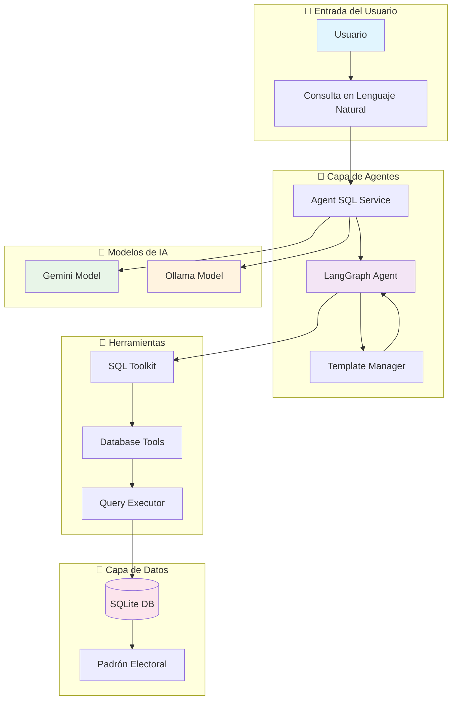
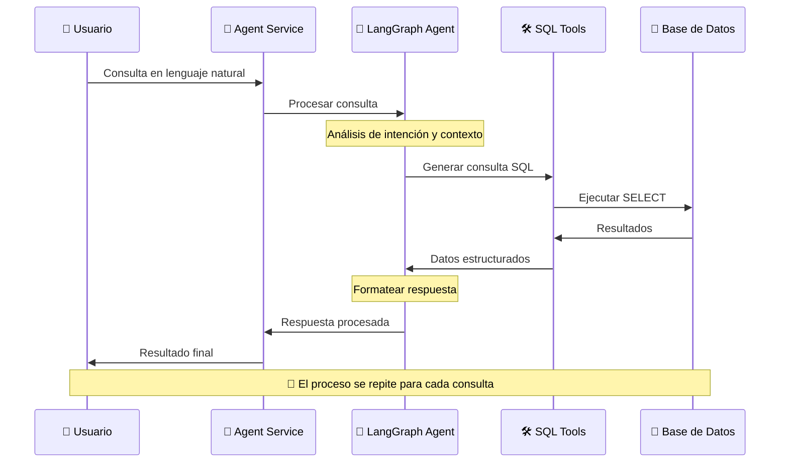
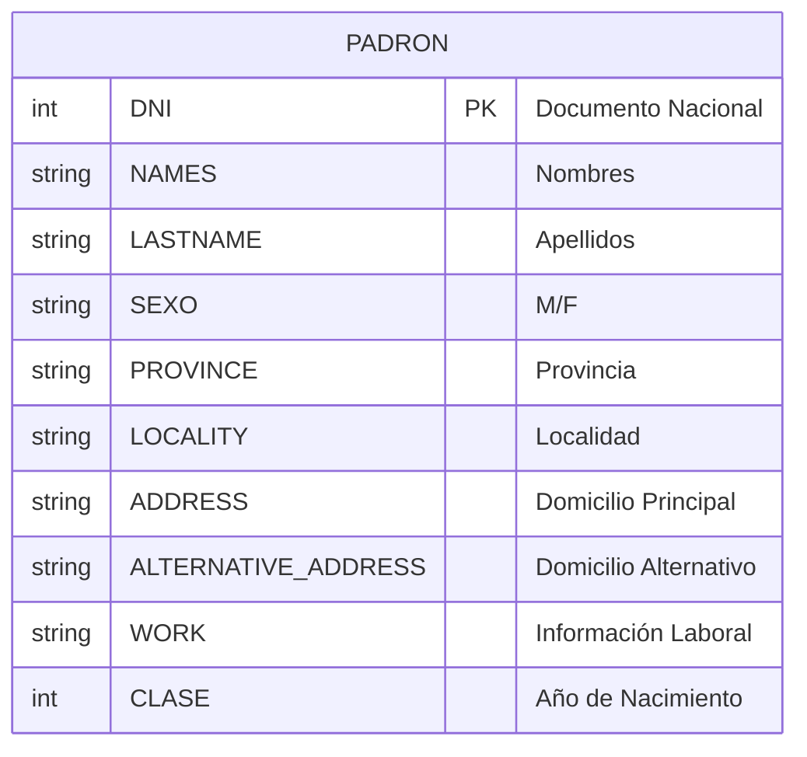

# 🤖 Agente LangChain SQL - Sistema de Consultas Electorales

Un sistema avanzado de agentes inteligentes construido con **LangChain** y **LangGraph** para realizar consultas automatizadas en bases de datos de padrones electorales. El sistema utiliza modelos de IA (Gemini/Ollama) para interpretar consultas en lenguaje natural y ejecutar consultas SQL precisas.

## 🚀 Características Principales

- **🧠 Agentes Inteligentes**: Procesamiento de lenguaje natural con LangGraph
- **🔗 Múltiples Modelos**: Soporte para Google Gemini y Ollama
- **📊 Base de Datos SQL**: Integración con SQLite para datos electorales
- **🛠️ Arquitectura Modular**: Estructura organizada y escalable
- **📝 Notebooks Interactivos**: Ejemplos prácticos de uso
- **⚡ Búsqueda Inteligente**: Manejo de datos inconsistentes y errores tipográficos

## 🏗️ Arquitectura del Sistema



## 🔄 Flujo de Procesamiento de Consultas



## 📊 Estructura de Datos del Padrón Electoral



## 🗂️ Estructura del Proyecto

```
agenteLanchain/
├── 📓 Notebooks/
│   ├── agent_search.ipynb    # Ejemplos de búsqueda
│   └── agent_sql.ipynb       # Demos SQL interactivas
├── 📱 app/
│   ├── config/               # ⚙️ Configuraciones
│   │   └── template.py       # Plantillas de prompts
│   ├── controller/           # 🎮 Controladores
│   │   └── agent_sql.py      # Lógica de control SQL
│   ├── core/                 # 🔧 Núcleo del sistema
│   │   └── agent.py          # Factory de agentes
│   ├── database/             # 💾 Acceso a datos
│   │   └── db.py             # Conexión SQLite
│   ├── models/               # 🧠 Modelos de IA
│   │   ├── gemini.py         # Integración Google Gemini
│   │   └── ollama.py         # Integración Ollama
│   ├── services/             # 🔄 Servicios de negocio
│   │   └── agent_sql_services.py  # Orquestador principal
│   └── utils/                # 🛠️ Utilidades
│       └── tools_sql.py      # Herramientas SQL
├── 🗄️ Xp.db                  # Base de datos SQLite
├── 🏠 main.py                # Punto de entrada
└── 📋 requirements.txt       # Dependencias
```

## 🚀 Instalación y Configuración

### 1. Clonar el repositorio
```bash
git clone https://github.com/gabykap29/agent-search.git
cd agent-search
```

### 2. Crear entorno virtual
```bash
python -m venv env
```

### 3. Activar entorno virtual

**Windows:**
```bash
env\Scripts\activate
```

**Linux/Mac:**
```bash
source env/bin/activate
```

### 4. Instalar dependencias
```bash
pip install -r requirements.txt
```

### 5. Configurar variables de entorno

Crear archivo `.env`:
```bash
# Configuración del modelo
MODEL=GEMINI  # o OLLAMA

# API Key de Google Gemini
GOOGLE_API_KEY=tu_api_key_aqui
GEMINI_MODEL=gemini-pro

# Configuración Ollama (si usas Ollama)
OLLAMA_MODEL=llama3
```

## 💡 Uso del Sistema

### Desde Python

```python
from app.services.agent_sql_services import agent_sql

# Consulta en lenguaje natural
resultado = agent_sql("Busca personas con DNI 12345678")
print(resultado)

# Consultas más complejas
resultado = agent_sql("Encuentra todos los Juan Pérez en Buenos Aires")
print(resultado)
```

### Desde Notebooks

Abre `agent_sql.ipynb` para ver ejemplos interactivos y casos de uso detallados.

## 🔍 Ejemplos de Consultas

### Búsqueda por DNI
```python
agent_sql("Busca información de la persona con DNI 20123456")
```

### Búsqueda por nombre
```python
agent_sql("Encuentra personas llamadas María García")
```

### Búsqueda por ubicación
```python
agent_sql("Lista personas de la provincia de Córdoba")
```

### Búsquedas complejas
```python
agent_sql("Busca mujeres nacidas en 1985 que vivan en Buenos Aires")
```

## 🎯 Características Especiales

### 🔧 Manejo Inteligente de Datos
- **Búsqueda difusa**: Maneja errores tipográficos y variaciones
- **Normalización automática**: Procesa datos inconsistentes
- **Consultas optimizadas**: Genera SQL eficiente

### 🔄 Flexibilidad de Modelos
- **Google Gemini**: Para alta precisión y capacidades avanzadas
- **Ollama**: Para ejecución local y privacidad

### 📊 Casos de Uso
- Consultas de padrón electoral
- Análisis demográfico
- Verificación de identidad
- Estudios de población

## 🤝 Contribuir

1. Fork el proyecto
2. Crea tu rama feature (`git checkout -b feature/AmazingFeature`)
3. Commit tus cambios (`git commit -m 'Add some AmazingFeature'`)
4. Push a la rama (`git push origin feature/AmazingFeature`)
5. Abre un Pull Request


## 👥 Autores

- **Gabriel Acosta** - *Desarrollador Principal* - [@gabykap29](https://github.com/gabykap29)

## 🙏 Reconocimientos

- [LangChain](https://langchain.com/) - Framework de IA
- [LangGraph](https://langgraph-sdk.vercel.app/) - Orquestación de agentes
- [Google Gemini](https://ai.google.dev/) - Modelo de IA
- [Ollama](https://ollama.ai/) - Modelos locales

---
